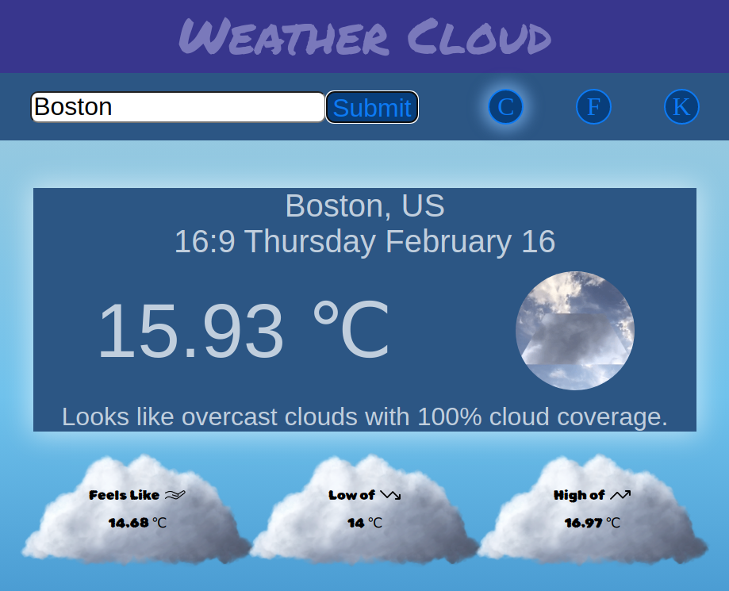

# Weather Cloud
## Weather app that automatically displays weather information for your locality using OpenWeatherMap API 

### [Live Preview](https://manski117.github.io/weather-app/)

**Purpose of Project:**
This portfolio project is a Weather Application that showcases my skills in front-end web development, API integration, and responsive design. 

**Core Features:**

The project includes several features, such as leveraging the Google Geolocation API to display the user's local weather data on the page and allowing for users to search for weather information on other cities. 
Users also have the option to have temperature displayed in different formats and the data is displayed in visual elements that look like clouds and scale in size with the page. 
